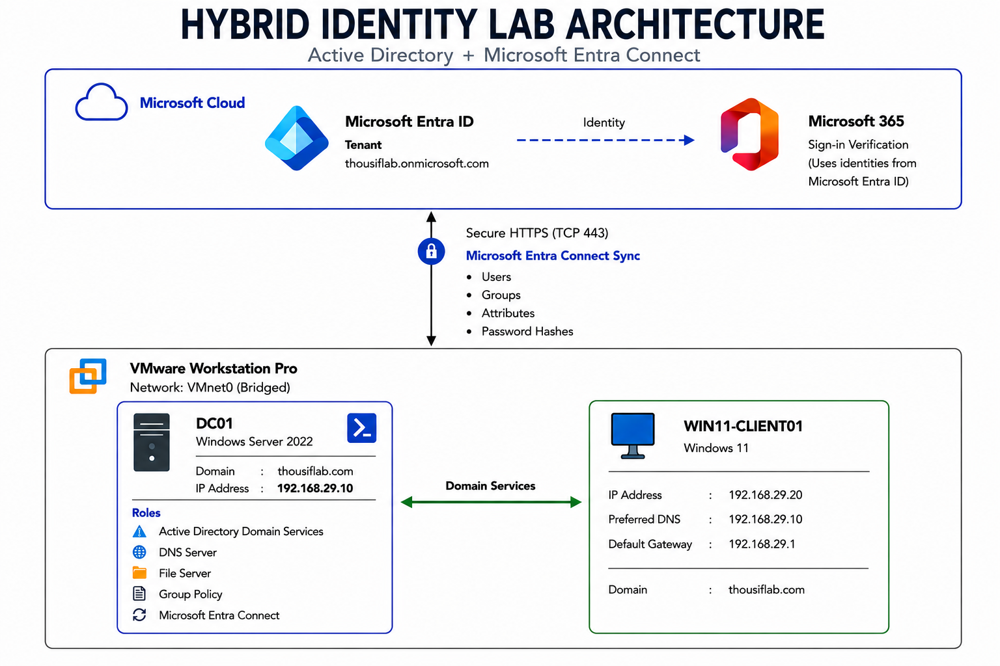

# Hybrid Identity Lab - Microsoft Entra Connect


A hybrid identity lab built with **Windows Server 2022**, **Active Directory**, **Microsoft Entra Connect**, and **Microsoft Entra ID** using **Password Hash Synchronization (PHS)**.


This repository contains the complete setup of a hybrid identity environment, including documentation, PowerShell scripts, and screenshots captured throughout the lab.





---


## Connect


- **GitHub:** https://github.com/Thousif1008

- **LinkedIn:** https://www.linkedin.com/in/mohammedthousifraza/

- **Credly:** https://www.credly.com/users/mohammed-thousif-raza


---


## Lab Overview


This lab was built in **VMware Workstation Pro** using **Windows Server 2022** as the domain controller and **Windows 11 Pro** as the client machine.


Microsoft Entra Connect was configured to synchronize the on-premises Active Directory environment with Microsoft Entra ID using **Password Hash Synchronization (PHS)**.


The repository includes the complete implementation process, PowerShell automation, synchronization, validation, troubleshooting, and screenshots captured throughout the lab.


---


## Features


- Active Directory Domain Services (AD DS)

- DNS Configuration

- Organizational Unit (OU) Management

- User Synchronization

- Group Synchronization

- Group Policy Configuration

- Microsoft Entra Connect Installation

- Password Hash Synchronization (PHS)

- PowerShell Automation

- Synchronization Validation

- Troubleshooting


---


## Lab Environment


| Component | Details |

|-----------|---------|

| Hypervisor | VMware Workstation Pro |

| Domain Controller | Windows Server 2022 |

| Client | Windows 11 Pro |

| Domain | thousiflab.com |

| Microsoft Entra Tenant | thousiflab.onmicrosoft.com |

| Synchronization Method | Password Hash Synchronization (PHS) |


---


## Technologies


- Windows Server 2022

- Active Directory Domain Services

- Microsoft Entra ID

- Microsoft Entra Connect

- Microsoft 365 Admin Center

- PowerShell

- DNS

- Group Policy

- VMware Workstation Pro


---


## Project Structure


```text

Hybrid-Identity-Lab-Azure-AD-Connect

│

├── Architecture

│   └── Hybrid_Identity_Lab_Architecture.png

│

├── Documentation

│   ├── 01 - Lab Overview.md

│   ├── 02 - Lab Architecture.md

│   ├── 03 - Prerequisites.md

│   ├── 04 - Microsoft 365 Tenant.md

│   ├── 05 - Active Directory.md

│   ├── 06 - Microsoft Entra ID.md

│   ├── 07 - Entra Connect.md

│   ├── 08 - Synchronization.md

│   ├── 09 - Hybrid Identity Testing.md

│   ├── 10 - PowerShell.md

│   ├── 11 - Synchronization Health.md

│   ├── 12 - Attribute Synchronization.md

│   ├── 13 - Password Hash Synchronization.md

│   ├── 14 - Group Synchronization.md

│   ├── 15 - Troubleshooting.md

│   └── 16 - Lessons Learned.md

│

├── PowerShell

│   ├── Create-OUs.ps1

│   ├── Create-SecurityGroups.ps1

│   ├── Import-EnterpriseUsers-XLSX.ps1

│   ├── Start-ADSyncInitialSync.ps1

│   ├── Start-ADSyncDeltaSync.ps1

│   └── Get-ADSyncScheduler.ps1

│

└── Screenshots

```


---


## Documentation


The complete implementation guide is available in the **Documentation** folder.


| Document | Description |

|----------|-------------|

| [01 - Lab Overview](Documentation/01%20-%20Lab%20Overview.md) | Project overview |

| [02 - Lab Architecture](Documentation/02%20-%20Lab%20Architecture.md) | Lab architecture and components |

| [03 - Prerequisites](Documentation/03%20-%20Prerequisites.md) | Software and environment requirements |

| [04 - Microsoft 365 Tenant](Documentation/04%20-%20Microsoft%20365%20Tenant.md) | Microsoft 365 tenant setup |

| [05 - Active Directory](Documentation/05%20-%20Active%20Directory.md) | Active Directory configuration |

| [06 - Microsoft Entra ID](Documentation/06%20-%20Microsoft%20Entra%20ID.md) | Microsoft Entra ID preparation |

| [07 - Entra Connect](Documentation/07%20-%20Entra%20Connect.md) | Microsoft Entra Connect installation and configuration |

| [08 - Synchronization](Documentation/08%20-%20Synchronization.md) | Initial and Delta synchronization |

| [09 - Hybrid Identity Testing](Documentation/09%20-%20Hybrid%20Identity%20Testing.md) | Hybrid identity validation |

| [10 - PowerShell](Documentation/10%20-%20PowerShell.md) | PowerShell commands and scripts |

| [11 - Synchronization Health](Documentation/11%20-%20Synchronization%20Health.md) | Synchronization health checks |

| [12 - Attribute Synchronization](Documentation/12%20-%20Attribute%20Synchronization.md) | Attribute synchronization |

| [13 - Password Hash Synchronization](Documentation/13%20-%20Password%20Hash%20Synchronization.md) | Password Hash Synchronization |

| [14 - Group Synchronization](Documentation/14%20-%20Group%20Synchronization.md) | Group synchronization |

| [15 - Troubleshooting](Documentation/15%20-%20Troubleshooting.md) | Common issues and resolutions |

| [16 - Lessons Learned](Documentation/16%20-%20Lessons%20Learned.md) | Key takeaways from the lab |


---


## PowerShell Scripts


The following scripts were used to automate common Active Directory and Microsoft Entra Connect tasks.


| Script | Description |

|---------|-------------|

| `Create-OUs.ps1` | Creates the Organizational Unit (OU) structure. |

| `Create-SecurityGroups.ps1` | Creates department security groups. |

| `Import-EnterpriseUsers-XLSX.ps1` | Imports users from an Excel workbook into Active Directory. |

| `Start-ADSyncInitialSync.ps1` | Starts an Initial Synchronization cycle. |

| `Start-ADSyncDeltaSync.ps1` | Starts a Delta Synchronization cycle. |

| `Get-ADSyncScheduler.ps1` | Displays the Microsoft Entra Connect synchronization schedule. |


---


## Implementation


### VMware Workstation


The lab environment was created in VMware Workstation Pro with separate virtual machines for the domain controller and Windows 11 client.


---


### Active Directory


The Active Directory environment includes Organizational Units (OUs), department users, security groups, DNS configuration, and Group Policy.


---


### Microsoft Entra Connect


Microsoft Entra Connect was installed and configured to synchronize the on-premises Active Directory environment with Microsoft Entra ID using Password Hash Synchronization (PHS).


---


### Initial Synchronization


After the initial synchronization completed, the on-premises Active Directory users appeared in Microsoft Entra ID.


---


### Hybrid Identity Validation


A new user was created in Active Directory to verify synchronization.


**User created in Active Directory**


After running a Delta Synchronization, the same user appeared in Microsoft Entra ID.


**User synchronized to Microsoft Entra ID**


---


### PowerShell


PowerShell was used to trigger synchronization cycles and verify the Microsoft Entra Connect scheduler.


---


## Skills Demonstrated


- Windows Server 2022 Administration

- Active Directory Domain Services (AD DS)

- Microsoft Entra ID

- Microsoft Entra Connect

- Hybrid Identity

- Password Hash Synchronization (PHS)

- DNS Management

- Group Policy Management

- Organizational Unit (OU) Administration

- User and Security Group Management

- PowerShell Automation

- Identity Synchronization

- VMware Workstation Pro

- Windows Client Administration

- Troubleshooting


---


## References


The following Microsoft Learn resources were used during the implementation of this lab.


- Microsoft Learn – Active Directory Domain Services: https://learn.microsoft.com/windows-server/identity/ad-ds/

- Microsoft Learn – Microsoft Entra ID: https://learn.microsoft.com/entra/

- Microsoft Learn – Microsoft Entra Connect: https://learn.microsoft.com/entra/identity/hybrid/connect/

- Microsoft Learn – Password Hash Synchronization (PHS): https://learn.microsoft.com/entra/identity/hybrid/connect/whatis-phs

- Microsoft Learn – PowerShell Documentation: https://learn.microsoft.com/powershell/

